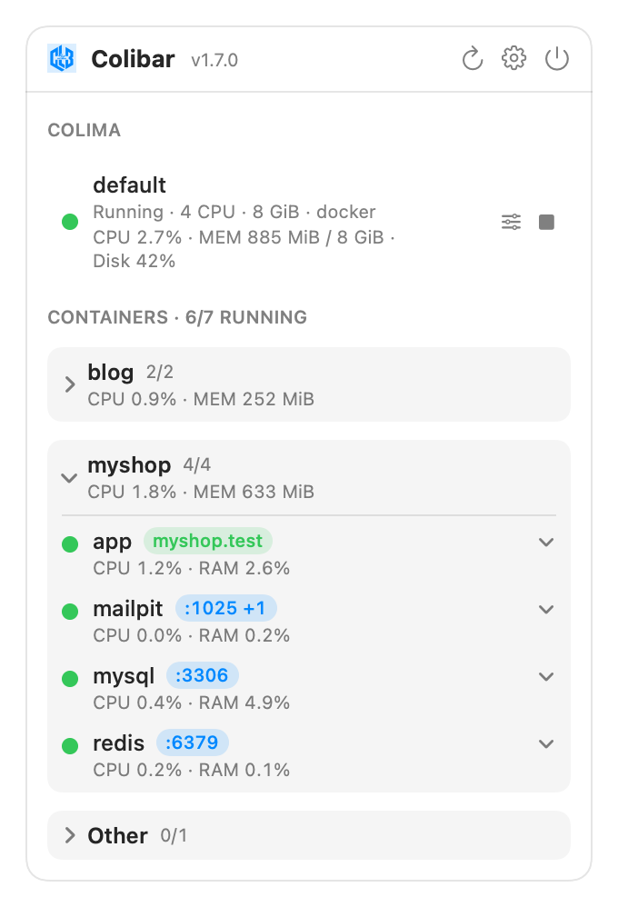

<p align="center">
  
</p>

<h1 align="center">Colibar</h1>

<p align="center"><b>Your Colima containers, one click away.</b><br>
A native macOS menu bar app for <a href="https://github.com/abiosoft/colima">Colima</a> — grouped by Compose project, with live usage, health alerts, and free <code>https://myapp.test</code> domains.</p>

---

Colima is a fantastic Docker Desktop replacement — but it's CLI-only. If your day looks like `colima start`, `docker compose up -d`, and squinting at `docker ps` to figure out which of 20 containers belongs to which project, Colibar removes that friction:

- 🚀 **Start/stop anything in one click** — the Colima VM, a whole Compose project, or a single container.
- 📦 **Grouped the way you think** — every Compose project is a card (Laravel Sail stacks look great), with `running/total` counts and per-project CPU/RAM totals visible even when collapsed.
- 📊 **Live usage** — CPU and RAM per container, per project, and for the whole VM; disk-fill watching with a one-click *Reclaim Space* (prunes unused images and build cache — never your containers or volumes).
- 🩺 **Knows when things go wrong** — the menu bar icon turns red for failing healthchecks, restart loops, or a filling disk; an *Attention* card explains the problem and offers the fix. Crashed containers post a macOS notification.
- 🌐 **Real local domains, with HTTPS** — map a container to `myshop.test` in two clicks. Colibar manages `/etc/hosts`, runs a tiny built-in reverse proxy on ports 80/443 (websockets pass through — Reverb/Echo work), and signs certificates with a local CA for a real padlock. Like Valet, but for containers, with zero extra software.
- 🔎 **Details on demand** — runtime versions straight from inside each container (`php 8.3.31 · composer 2.7.9 · node 22.11`), image, ports, size — in a slide-down panel per row.
- 🖥 **Terminal when you want it** — logs, shells, whole-project `compose logs -f`, or a terminal cd'd into the project, all in Terminal.app with a real TTY.
- 🔋 **Polite by default** — polling slows to a heartbeat while the panel is closed; version and stats probing never blocks the UI.

No Docker Desktop. No Electron. No third-party dependencies. One ~1 MB native binary.

## Install

**Requirements:** macOS 14+, [Colima](https://github.com/abiosoft/colima) and the docker CLI (`brew install colima docker`).

1. Download the latest `Colibar-vX.Y.Z.zip` from [Releases](https://github.com/syahrul84/colibar/releases), unzip, and drag `Colibar.app` into `/Applications`.
2. First launch: **right-click → Open** (the app is not notarized yet, so macOS warns once). Alternatively: `xattr -d com.apple.quarantine /Applications/Colibar.app`.
3. Click the hexagon in your menu bar. That's it — Colibar finds your Colima and containers automatically (and tells you the `brew install` command if they're missing).

Colibar checks GitHub Releases for updates (daily, or on demand from Settings) and can install them in place.

## The `.test` domains, in 30 seconds

1. Settings → enable **Local .test domains** (one admin prompt for `/etc/hosts`).
2. Hover a container → click the globe → name it `myshop` → Save.
3. `http://myshop.test` now serves your container. Enable **HTTPS** (trust the local CA once) and `https://myshop.test` gets a real padlock — `X-Forwarded-Proto` headers included, so Laravel behind it generates correct URLs (set `$middleware->trustProxies(at: '*')`).

## Build from source

```bash
git clone https://github.com/syahrul84/colibar.git && cd colibar
./build-app.sh install   # build + install to /Applications
./build-app.sh run       # dev loop: build + install + relaunch
swift run colibar-tests  # parser test suite (95 assertions, no Xcode needed)
```

SwiftPM only — no Xcode project, no dependencies. The core layer (`ColibarCore`) holds all CLI parsing and never touches UI; if a future Colima release changes its output, [one file](Sources/ColibarCore/ColimaService.swift) needs editing and the tests will say so.

<details>
<summary><b>macOS engineering notes</b> (the fun bugs live here)</summary>

- **PATH**: Finder-launched apps can't see Homebrew; binaries are found by probing install directories directly, with a cached login-shell lookup as last resort — misses are cached too, so polling stays cheap when Colima isn't installed.
- **Pipes**: subprocess output is drained on concurrent queues with a SIGTERM→SIGKILL watchdog; sequential reads deadlock past ~64 KB.
- **MenuBarExtra sizing**: `.window`-style panels hug the content's *ideal* height and a ScrollView's ideal height is zero — content is measured via GeometryReader + PreferenceKey or the panel collapses to its header.
- **Certificate trust**: `security add-trusted-cert` must be scoped `-p ssl`. Unscoped, your local CA joins *code-signing* trust evaluation and Gatekeeper launch assessments stall machine-wide. Ask us how we know.
- **`@AppStorage` in ObservableObject**: writes via SwiftUI Bindings bypass `didSet` and publish nothing; preferences are `@Published` + manual UserDefaults.

</details>

## Support

Colibar is free and open source. If it saves you some friction every day:

<a href="https://ko-fi.com/syahrul84">☕ <b>Send a tip on Ko-fi</b></a> · ⭐ <b>Star this repo</b> — both are also one click away in the app's Settings.

## Non-goals

Image management, volume browsing, Kubernetes, container creation. Colibar is a control surface for containers you already run — your compose files stay the source of truth.
